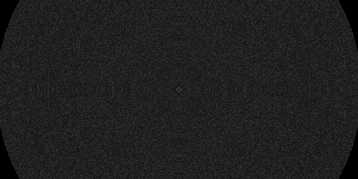
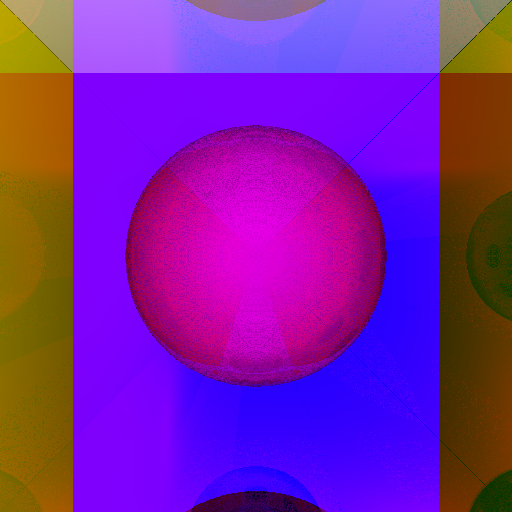
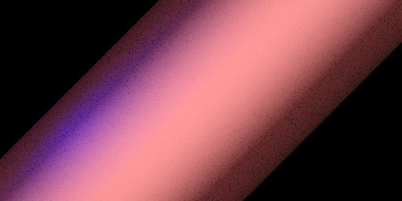
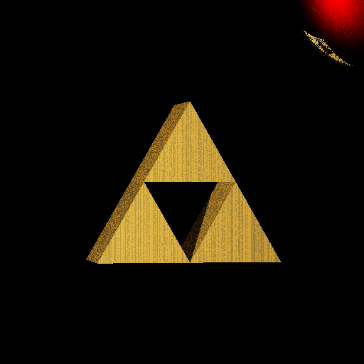

# Examples
The project supports multiple example inputs, that can be found in the `examples` directory. They serve as reference to create your own .json input files, as well as a simple way to test that the build works as expected.

## example1.json
This is the example given by Thibaut Lunet as illustration example. It should ouput a gray, crumbly sphere.

## example2.json
This is a very colorful example, where we have a purple sphere in a box of differently colored, mirror-like Half-Spaces.

## example3.json
This example showcases our third primitive, the Cylinder. It appears in a bronz-like color with a hot-spot of purple color on the left side, where an additional light source is located.

## example4.json
Our final example shows the *Triforce* from *The Legend of Zelda* under a reflective *blood moon*.
